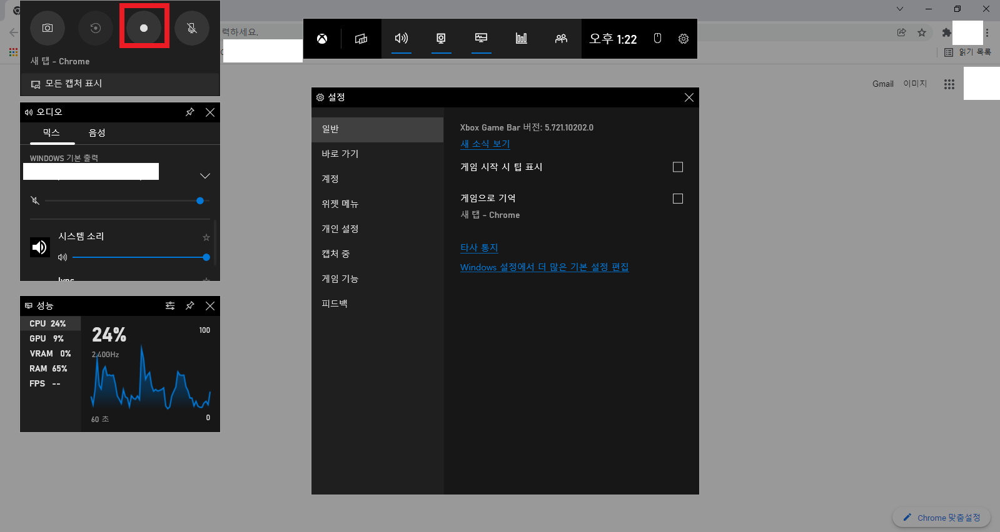

[toc]

# 윈도우 화면녹화

화상 수업, 미팅, 프로그램등이 증가하면서 화면녹화의 필요성이 증가하고 있다.

윈도우 환경에서 쉽게 화면녹화하는 방법을 알아 볼 것 이다.

## 화면녹화 창

### 단축키

`Win` + `G`

윈도우 키 와 G키를 누르면 다음과 같은 화면이 뜨게 된다.

윈도우 게임센터라고 뜨지만 크게 신경쓸 필요 없다.

동그란 녹화버튼을 누르면 자동으로 녹화가 되며

해당 녹화 파일은 `내 PC - 동영상 - 캡쳐`에 자동으로 저장된다.

## 바로 녹화

### 단축키

`Win` + `Alt` + `R`

해당 단축키를 누르면 바로 녹화가 된다.

물론 사양에 따라 버퍼링이 걸리거나 느리게 창이 뜰 수 있다.

## 참고사항

* 시스템의 기본 소리로 녹화된다.
* 마이크 표시는 본인의 마이크가 녹음되는지의 여부이다.
* 활성된 창을 기준으로 녹화하며 프로그램이 하나도 없을 경우 실행되지 않을 수 있다.